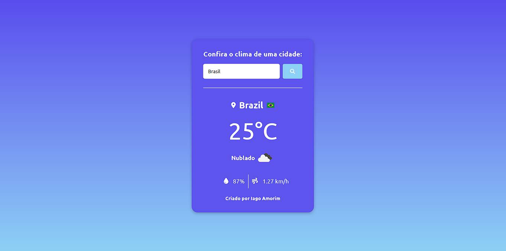

# Clima App

Clima App é uma aplicação web para consultar as condições climáticas de uma cidade em tempo real. O projeto foi desenvolvido utilizando **React**, **Vite** e **OpenWeather API** para mostrar informações detalhadas sobre o clima, como temperatura, umidade e vento.

## Tecnologias Utilizadas

- **React**: Biblioteca JavaScript para construir interfaces de usuário.
- **Vite**: Ferramenta de build de desenvolvimento rápido para projetos modernos.
- **OpenWeather API**: API para obter informações climáticas em tempo real.
- **Font Awesome**: Ícones para uma interface visual mais rica.
- **CSS Modules**: Estilos CSS para componentes isolados.

## Funcionalidades

- Busca de clima por nome de cidade.
- Exibição das condições climáticas, incluindo temperatura, umidade, velocidade do vento e descrição.
- Exibição da bandeira do país da cidade.
- Exibição de erro se a cidade não for encontrada.

## Demonstração

  
**Link do site**: [https://projeto-clima-typescript.vercel.app/](#)

## Instalação

### 1. Clone o repositório

```bash
git clone https://github.com/Iago-Amorim/clima-app.git
```

### 2. Instale as dependências

```bash
npm install
```

### 3. Inicie o servidor de desenvolvimento

```bash
npm run dev
```

### 4. Acesse o projeto

Abra o navegador e acesse:

```
http://localhost:5173
```


## Contribuição

1. Faça um fork deste repositório.
2. Crie uma branch para a sua feature (`git checkout -b feature/nova-feature`).
3. Commit suas mudanças (`git commit -m 'Adiciona nova feature'`).
4. Faça o push para a branch (`git push origin feature/nova-feature`).
5. Abra um pull request.

## Autor

Criado por **Iago Assunção Amorim**

## Licença

Este projeto está sob a licença MIT - veja o arquivo [LICENSE](LICENSE) para mais detalhes.
